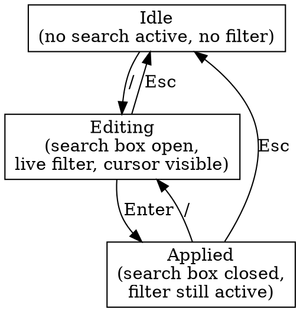

# cleader v0.4.5 — Library Search Design

**Date:** 2026-05-13
**Branch:** `impl/v0.1.0`
**Predecessor:** v0.4.4 (grid library view + cover cache, HEAD `80fcf40`)

## Goal

Press `/` from library view to open a live-filtering search box. Type to narrow the visible entries by case-insensitive substring match on title or author. Works identically in grid and list view modes. Esc clears and restores the original view.

## Why

- A directory with hundreds of books needs a way to jump to a specific title without paging.
- The grid view already shows covers — search lets the user filter that visual set the same way list-mode filters a textual one.
- Builds on v0.4.4: the cover cache, viewport request math, and view-mode infrastructure are reused without modification (filter narrows the index set; the rest of the pipeline doesn't care).

## Non-goals

- **No fuzzy matching** (fzf-style). Plain substring. Predictable.
- **No regex.** Same reason — keep mental model simple.
- **No search history or persistence.** Closing search closes search.
- **No match-highlighting in displayed titles.** Future polish.
- **No search-from-reader.** Search is a library-mode feature only; the reader's own text search is a separate future feature.

## State machine

Three states, identified internally by a `SearchMode` enum:



- **Idle** is the default state. No filter; selection moves over the full `entries` slice.
- **Editing** opens when `/` is pressed in Idle, or when `/` is pressed in Applied (re-edit existing query). Every printable keystroke updates the query and re-filters; selection resets to 0 (first match). Up/Down/Left/Right arrows navigate matches without exiting the box. Enter commits → Applied. Esc clears → Idle (and restores `pre_search_selection`).
- **Applied** has the search box closed but the filter is still in effect. The renderer shows only filtered entries; selection moves through that filtered set. Pressing `/` re-opens the box pre-populated with the existing query. Esc clears the filter and restores `pre_search_selection`.

## Filter semantics

Case-insensitive substring match. Title OR author matches → entry included.

To avoid recomputing lowercase strings on every keystroke, `LibraryApp` builds a parallel `Vec<String>` of `format!("{title}\n{author}").to_lowercase()` at `LibraryApp::new` (one entry per book). The `\n` separator means the substring search runs against title and author together — a query that spans the boundary will fail (a desirable behavior: "X by Y" type queries should match title or author independently, not a concatenation).

Per-keystroke cost: lowercase the query once, then `haystack.contains(&query)` per entry. ~50 microseconds for 500 books — imperceptible. No indexing needed for any realistic library size (10K+ books would be tens of milliseconds but still well below typing speed).

Empty query in Editing state → no filter applied (show all entries, same as Idle except the box is open).

## UI

The footer's hint row is replaced when search is active.

**Editing state** (cursor blinks at end of query):
```
/ firefly_                                  3 matches  ·  Enter apply · Esc cancel
```

**Applied state** (no cursor, post-Enter):
```
/ firefly                                   3 matches  ·  / refine · Esc clear
```

Layout: left-justified `/ <query>` (with a trailing `_` cursor block in Editing — terminal-portable; some terminals will show it as a steady block, others as a solid underscore, both fine). Right-justified `<N> matches  ·  <hint>`. If the terminal is too narrow to fit both, the hint truncates with an ellipsis. The cursor is `_` not the terminal's blinking cursor — we don't want crossterm to draw a cursor inside the alternate screen.

When `0` matches, the grid/list area shows a centered DIM `no matches` message (same pattern as the Help overlay). The footer still shows `0 matches`.

## Architecture

### New module `src/search.rs`

Holds the pure filter logic and the state container. ~80–120 lines.

```rust
//! Library search state and substring filter.

#[derive(Debug, Clone, Copy, PartialEq, Eq, Default)]
pub enum SearchMode {
    #[default]
    Idle,
    Editing,
    Applied,
}

#[derive(Debug, Clone, Default)]
pub struct SearchState {
    pub mode: SearchMode,
    pub query: String,
    pub filtered: Vec<usize>,  // indices into LibraryApp.entries; empty in Idle
}

/// Filter `haystacks` against `query`. Returns the indices of entries whose
/// haystack contains the lowercased query as a substring. Empty query
/// matches all (returns `(0..haystacks.len()).collect()`). Caller is
/// responsible for lowercasing haystacks at construction time.
pub fn filter_indices(haystacks: &[String], query: &str) -> Vec<usize>;
```

Tests in `search.rs`:
- empty query returns all indices
- exact match works
- case-insensitive (caller responsible for lowercasing query)
- substring match (mid-word)
- no-match returns empty
- multi-match returns multiple indices in source order
- title-or-author OR semantics (since haystack is `title\nauthor`)

### Changes to `library_app.rs`

New fields:
```rust
pub struct LibraryApp {
    // ... existing ...
    search: SearchState,
    /// Parallel to `entries`: `entries_lowercased[i]` = `format!("{title}\n{author}").to_lowercase()`.
    entries_lowercased: Vec<String>,
    /// Selection captured when search began. Restored on Esc.
    pre_search_selection: usize,
}
```

New methods:
- `is_searching(&self) -> bool` — true only in Editing state
- `has_filter(&self) -> bool` — true in Editing or Applied
- `search_query(&self) -> &str`
- `search_mode(&self) -> SearchMode`
- `display_indices(&self) -> &[usize]` — returns `&search.filtered` when `has_filter()`, else returns a `&[usize]` of `0..entries.len()` (lazily computed or stored on construction)
- `open_search(&mut self)` — Idle/Applied → Editing, captures `pre_search_selection`, resets query if was Idle
- `handle_search_input(&mut self, key: KeyEvent)` — consumes raw key events in Editing state (printable chars, Backspace, Enter, Esc, arrow keys)

The existing `selection: usize` field now indexes into `display_indices()` (the currently visible sequence), not the raw `entries`. When the app needs the actual `LibraryEntry`, it does `entries[display_indices()[selection]]`. The `book_id(idx: usize)` accessor takes the display index and resolves through `display_indices()` internally.

`selected_path()` resolves through `display_indices()` so Enter still opens the right book.

`Action` handler changes:
- New action `Action::OpenSearch` → calls `open_search()`
- All other actions handle through the regular path; in Applied state they operate on `display_indices()`

### Raw key consumption in Editing state

The `library_event_loop` in `main.rs` adds a top-of-loop branch:

```rust
if app.is_searching() {
    // In search-editing mode, bypass translate() so every printable key
    // is available as query input. Only Enter/Esc/arrows have special
    // semantics; everything else accumulates into the query.
    if event::poll(Duration::from_millis(50))? {
        let evt = event::read()?;
        if let Event::Key(key) = evt {
            app.handle_search_input(key);
            needs_redraw = true;
        }
    }
    continue;
}
// ... existing translate + handle flow ...
```

This keeps the Action enum clean (no `TypeChar(char)` or `Backspace` variants leaking into a global enum that's mostly modal navigation). Only one new variant: `Action::OpenSearch`.

`handle_search_input(key: KeyEvent)` dispatches based on key code:
- `Enter` → transition Editing → Applied
- `Esc` → clear state, restore `pre_search_selection`, transition → Idle
- `Backspace` → pop last char from query, re-filter
- `Up/Down/Left/Right` → navigate `display_indices()` (same as in Applied/Idle)
- `Char(c)` (printable) → append to query, re-filter, reset selection to 0
- Anything else → ignore

### New action variant

```rust
// in input.rs Action enum (#[non_exhaustive])
OpenSearch,
```

Key binding in `translate_key`:
```rust
(Char('/'), false, _) => Some(Action::OpenSearch),
```

`/` is currently unbound, so no conflict.

### Renderer changes (`reader.rs`)

`LibraryRenderInput` gains:
```rust
pub display_indices: &'a [usize],
pub search_query: Option<&'a str>,
pub search_mode: SearchMode,
```

`render_library_list` and `render_library_grid` iterate over `display_indices` (mapped through `entries`) instead of `entries` directly. The cell/row count, scroll math, and selection highlight all operate on the display index sequence.

Footer rendering becomes 3-way:
- Search active (Editing or Applied) → render the search box (as described in UI)
- `warning` set → existing warning style
- Default → existing hint string

If 0 matches: in addition to footer "0 matches", the grid/list content area renders a centered DIM `no matches` paragraph.

### Cover request integration

The visible-window math in `library_event_loop` already operates on entry indices. Now it operates on `display_indices()`:

```rust
let display = app.display_indices().to_vec();  // snapshot
if let Some(range) = visible_grid_range(...) {
    // range = display-relative indices, e.g. 0..6
    let entry_indices = range.map(|i| display[i]);
    app.request_visible_covers(entry_indices);
}
```

Result: filtering to 3 matches means at most 3 cover requests, regardless of library size. The worker thread never wastes cycles on filtered-out books.

## Selection semantics

`selection: usize` indexes into `display_indices()`, not raw entries.

- **Idle/Applied at construction**: `display_indices()` is the full entries (Idle) or filtered (Applied). Selection moves through it normally.
- **/ pressed (Idle → Editing)**: capture `pre_search_selection = selection`, reset query to empty (or keep existing if Applied → Editing transition). `display_indices()` is recomputed from the empty/existing query.
- **Each keystroke in Editing**: filter recomputes; `selection = 0` (top of new match set).
- **Enter (Editing → Applied)**: selection stays where it is in the filtered set.
- **Esc**: clear query, `display_indices()` returns to full set, `selection = pre_search_selection`. → Idle.

The pre_search_selection restore handles the "I searched, looked, decided to bail" case cleanly: cursor goes back to where it was.

## Error handling

Search has no I/O and no fallible operations. Edge cases:
- Empty library: `/` is allowed but typing/filtering produces 0 results, footer shows `0 matches`.
- Query with characters that don't appear in any haystack: same — 0 matches, footer says so.
- Unicode in queries: handled correctly by Rust's `str::contains`. Lowercasing uses the same Unicode-aware path as `entries_lowercased`.

## Testing

### `search.rs` unit tests (pure functions)
- `empty_query_matches_all`
- `substring_match_lowercase`
- `case_insensitive_match` (caller-lowercased)
- `mid_word_substring_match`
- `no_match_returns_empty_indices`
- `multi_match_returns_source_order_indices`
- `title_match_works`
- `author_match_works`
- `match_does_not_cross_boundary` (query containing the `\n` separator should not match across title-author boundary if user types only chars)

### `library_app.rs` unit tests
- `/` opens search (transitions Idle → Editing, captures pre_search_selection)
- Typing chars updates query and refilters
- Backspace pops query
- Enter transitions Editing → Applied
- Esc from Editing clears + restores selection → Idle
- Esc from Applied clears + restores selection → Idle
- `/` from Applied re-enters Editing with existing query
- Selection in Applied state moves through filtered indices only
- Empty library + `/` doesn't panic
- Up/Down arrows in Editing navigate filtered results (selection moves, query unchanged)

### `reader.rs` rendering tests (TestBackend)
- Search box visible in footer in Editing mode (both grid + list)
- Search box visible in footer in Applied mode (both grid + list)
- `no matches` centered when filter returns empty
- Footer hides search box in Idle

### Integration test (`tests/integration.rs`)
- End-to-end: scan tmp library, open `/`, type a substring, verify filter narrows, Enter to apply, Esc to clear

Target test count after v0.4.5: roughly 225 unit + 11 integration (added: ~9 search + ~10 library_app + ~4 renderer + 1 integration ≈ 24 new).

## What ships at the end of v0.4.5

- `/` from library opens a live-filter search box
- Substring match on title or author (case-insensitive)
- Filter narrows the visible grid/list immediately on every keystroke
- Enter applies the filter and closes the box; arrow keys navigate filtered results
- Esc clears everything and returns cursor to where the user was before pressing `/`
- Search works identically in grid and list mode
- Cover generation respects the filter (no wasted work on filtered-out books)

## Implementation order (preview of plan)

Likely 5–6 tasks, each TDD'd and reviewed:
1. New `search.rs` module — `SearchMode`, `SearchState`, `filter_indices`, unit tests
2. `Action::OpenSearch` + `/` key binding in `input.rs`
3. Wire `search` + `entries_lowercased` + `pre_search_selection` into `LibraryApp`; add accessors + `open_search`
4. Add `handle_search_input(KeyEvent)` for Editing-state input
5. Extend `LibraryRenderInput` (`display_indices`, `search_query`, `search_mode`) and update `render_library_list` + `render_library_grid` + footer rendering
6. Switch `library_event_loop` to branch on `is_searching()`; update cover-request math through `display_indices()`; integration test

Final cross-cut review checks: cover request volume, selection-restore correctness, search box rendering at narrow terminals.
